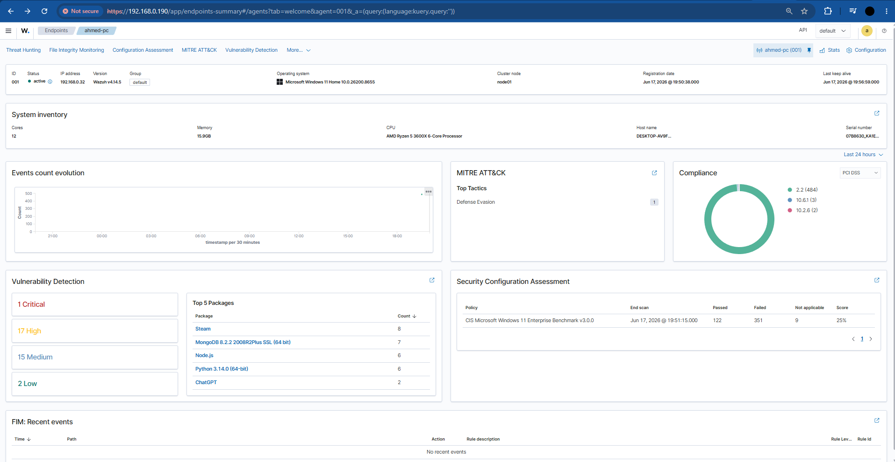

# SIEM Home Lab

A self-hosted SOC environment I built to practice the day-to-day workflows of a SOC analyst: agent onboarding, vulnerability detection, MITRE ATT&CK mapping, and CIS compliance assessment.

## Setup

- **SIEM:** Wazuh v4.14.5, single-node, deployed from the official OVA
- **Hypervisor:** Oracle VirtualBox
- **Monitored endpoint:** Windows 11 machine enrolled as a Wazuh agent
- **Modules enabled:** Threat Hunting, File Integrity Monitoring, Security Configuration Assessment, MITRE ATT&CK mapping, Vulnerability Detection

## What it found

- **CVE-2025-55130 (Critical, CVSS 9.1)** in the endpoint's Node.js install, plus 17 High / 15 Medium / 2 Low findings across the software inventory
- **489 events mapped to MITRE ATT&CK T1562.001** (Defense Evasion — Disable or Modify Tools), traced to scheduled software-protection service activity and flagged for baseline tuning
- **25% CIS benchmark compliance** — 351 of 482 checks failed against the CIS Windows 11 Enterprise Benchmark v3.0.0, consistent with an unhardened out-of-the-box install

## Full report

The complete write-up — lab setup, findings with dashboard evidence, risk summary, and remediation steps — is in [writeup.md](writeup.md).
