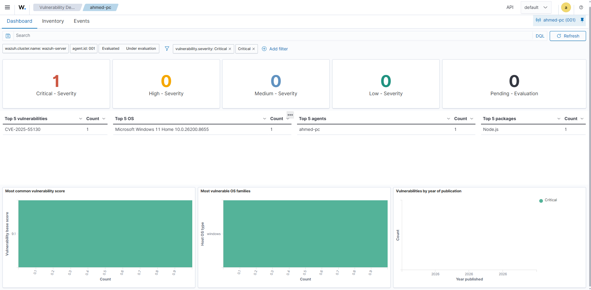
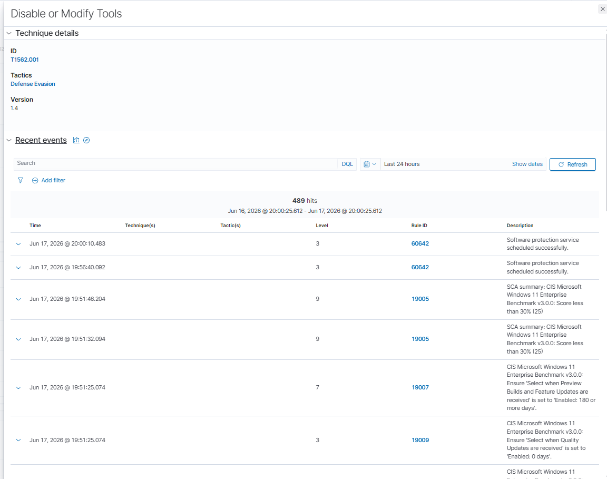

# SIEM Home Lab — Wazuh Endpoint Monitoring & Security Assessment

**Analyst:** Ahmed Helal
**Date:** June 17, 2026
**Environment:** Personal home lab (isolated, non-production)

---

## 1. Executive Summary

This engagement involved standing up a self-hosted SIEM using Wazuh and onboarding a Windows 11 endpoint as a monitored agent to practice detection engineering, vulnerability management, and security configuration assessment workflows used by SOC analysts.

During the monitoring period, the deployment surfaced one **Critical-severity vulnerability (CVE-2025-55130, CVSS 9.1)** in a Node.js installation, flagged **489 events** mapped to MITRE ATT&CK technique **T1562.001 (Defense Evasion — Disable or Modify Tools)**, and a CIS Microsoft Windows 11 Enterprise Benchmark compliance scan returning a score of **25%**, with **351 of 482 checks failing**. Findings and remediation steps are detailed below.

---

## 2. Lab Setup

| Component | Detail |
|---|---|
| SIEM Platform | Wazuh v4.14.5 (OVA appliance) |
| Hypervisor | Oracle VirtualBox |
| Wazuh Server | Single-node deployment (`node01`), IP `192.168.0.190` |
| Monitored Endpoint | Windows 11 Home (Build 10.0.26200.8655), hostname `ahmed-pc`, agent ID `001` |
| Endpoint Hardware (virtualized) | AMD Ryzen 5 3600X (12 cores), 15.9 GB RAM |
| Agent Status | Active, reporting on default group |
| Modules Enabled | Threat Hunting, File Integrity Monitoring (FIM), Configuration Assessment (SCA), MITRE ATT&CK mapping, Vulnerability Detection |

*Figure 1 — Wazuh endpoint summary dashboard for `ahmed-pc`, showing system inventory, MITRE ATT&CK top tactics, compliance, vulnerability detection, and SCA results.*

**Deployment notes:**
- The Wazuh manager was deployed from the official OVA image and imported directly into VirtualBox to minimize manual server configuration and focus on agent onboarding and detection tuning.
- The Windows 11 endpoint (`ahmed-pc`) was registered as an agent and connected to `node01` over the internal lab network, with the Wazuh dashboard accessed via `https://192.168.0.190`.
- Vulnerability Detection, Security Configuration Assessment (SCA), File Integrity Monitoring, and MITRE ATT&CK mapping modules were enabled to provide full-spectrum visibility comparable to a production SOC monitoring stack.

---

## 3. Findings

### 3.1 Critical Vulnerability — CVE-2025-55130 (Node.js)

| Field | Value |
|---|---|
| CVE ID | CVE-2025-55130 |
| Severity | **Critical** |
| CVSS Score | **9.1** |
| Affected Package | Node.js |
| Affected Asset | `ahmed-pc` (agent 001) |
| Detection Source | Wazuh Vulnerability Detection module |

The Vulnerability Detection dashboard identified one Critical-severity finding on the endpoint, attributed to the installed Node.js package. Given the CVSS 9.1 rating, this vulnerability carries a high likelihood of remote exploitation with significant impact to confidentiality, integrity, and/or availability if left unpatched. Additional lower-severity findings were also observed across the endpoint's software inventory (17 High, 15 Medium, 2 Low), with Node.js, Steam, MongoDB, Python, and ChatGPT-related packages appearing among the top affected components.

*Figure 2 — Vulnerability Detection dashboard filtered to Critical severity, confirming CVE-2025-55130 (CVSS 9.1) on `ahmed-pc`, affecting the Node.js package.*

### 3.2 MITRE ATT&CK — T1562.001 (Defense Evasion: Disable or Modify Tools)

| Field | Value |
|---|---|
| Technique ID | T1562.001 |
| Tactic | Defense Evasion |
| Technique Version | 1.4 |
| Event Count | **489 hits** (last 24 hours) |
| Top Rule ID Observed | 60642 — "Software protection service scheduled successfully" |

The dashboard's MITRE ATT&CK module flagged **489 events** correlating to T1562.001, indicating repeated activity consistent with security tooling or protection services being scheduled, modified, or interacted with on the endpoint. While the majority of these events traced back to a low-severity rule (level 3) tied to scheduled software protection service execution, the volume and consistency of the activity warranted classification under this Defense Evasion technique and is flagged here for analyst review and baseline tuning.

*Figure 3 — T1562.001 (Disable or Modify Tools) technique detail, showing 489 hits over the last 24 hours.*

### 3.3 CIS Benchmark Compliance — 25% Pass Rate

| Field | Value |
|---|---|
| Policy | CIS Microsoft Windows 11 Enterprise Benchmark v3.0.0 |
| Compliance Score | **25%** |
| Passed Checks | 122 |
| **Failed Checks** | **351** |
| Not Applicable | 9 |
| Scan Completed | June 17, 2026, 19:51:15 |

The Security Configuration Assessment (SCA) module ran the full CIS Windows 11 Enterprise Benchmark against `ahmed-pc` and returned a compliance score of **25%**, with **351 failed checks** — the majority of the policy. Notable failed controls included missing restrictions on Preview Builds / Feature Updates and Quality Update deferral settings, both of which affect patch management posture. A compliance score this low is consistent with a default, out-of-the-box Windows 11 Home installation that has not been hardened against an enterprise security baseline, and represents the largest single area of risk identified in this assessment.

---

## 4. Risk Summary

| Finding | Severity | Risk Rationale |
|---|---|---|
| CVE-2025-55130 (Node.js) | Critical (CVSS 9.1) | Unpatched critical vulnerability with high exploitability potential |
| T1562.001 — Defense Evasion (489 events) | Medium | High event volume tied to a technique commonly used to disable security controls; requires baselining to rule out benign scheduled-task noise |
| CIS Benchmark — 25% compliance (351 failed) | High | Broad configuration weaknesses across patch management, system hardening, and policy enforcement increase the endpoint's overall attack surface |

---

## 5. Remediation Steps

1. **Patch Node.js immediately.** Upgrade the affected Node.js installation on `ahmed-pc` to a version that remediates CVE-2025-55130. Treat this as priority-one given the Critical/9.1 rating; validate the fix with a follow-up Wazuh vulnerability scan.
2. **Triage and baseline T1562.001 activity.** Review the 489 flagged events to confirm the "software protection service" scheduling is legitimate, expected behavior rather than malicious tooling tampering. If confirmed benign, tune detection rules/whitelisting to reduce noise; if not, isolate the host and investigate further.
3. **Remediate CIS benchmark failures, prioritized by impact:**
   - Enforce update deferral and Preview Build/Feature Update controls per CIS guidance to improve patch management posture.
   - Work through the remaining failed checks in batches (access control, auditing, network security policies, etc.), re-running the SCA scan after each batch to track score improvement.
   - Set an interim target of 60%+ compliance, with a long-term goal of 85%+ aligned to CIS benchmark best practice.
4. **Enable continuous monitoring cadence.** Schedule recurring vulnerability and SCA scans (e.g., weekly) rather than relying on point-in-time assessments, so regressions and newly disclosed CVEs are caught quickly.
5. **Expand FIM coverage.** No FIM events were captured during this assessment window; review and adjust File Integrity Monitoring rules/paths to ensure critical system and application directories are actively covered.

---

## 6. Conclusion

This lab exercise demonstrated an end-to-end SIEM monitoring workflow — from agent deployment through vulnerability detection, MITRE ATT&CK technique mapping, and CIS compliance benchmarking — on a live Windows 11 endpoint. The findings highlight realistic gaps (an unpatched critical CVE, defense-evasion-adjacent activity, and weak baseline hardening) that mirror the kind of triage and remediation prioritization expected of a SOC analyst in a production environment.
